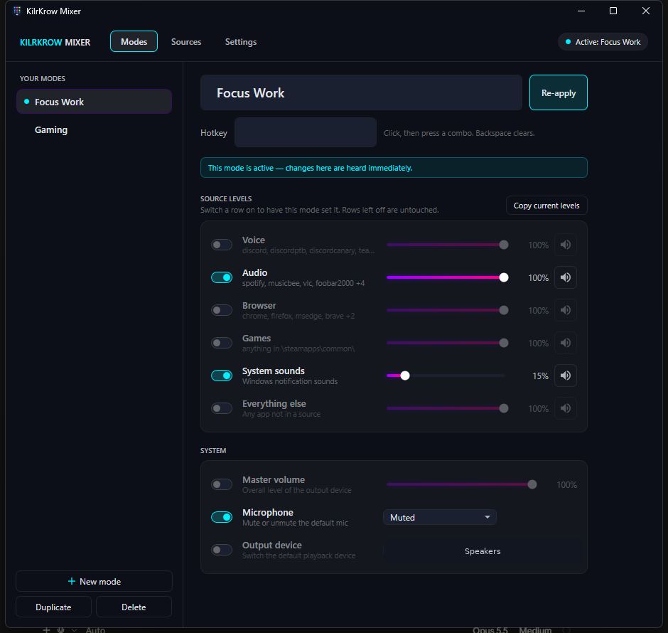
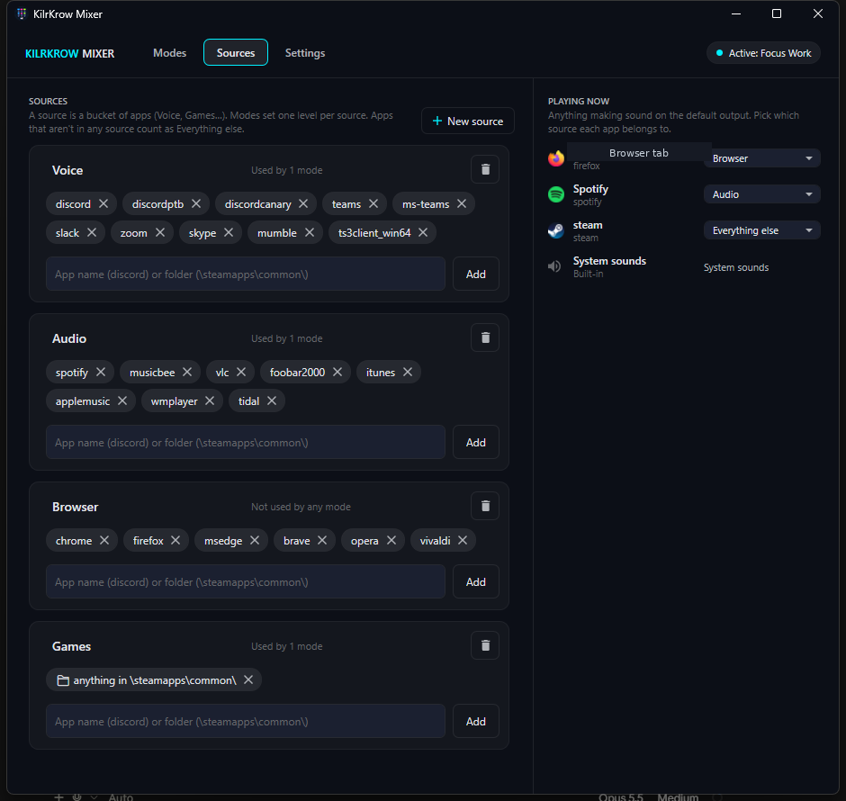
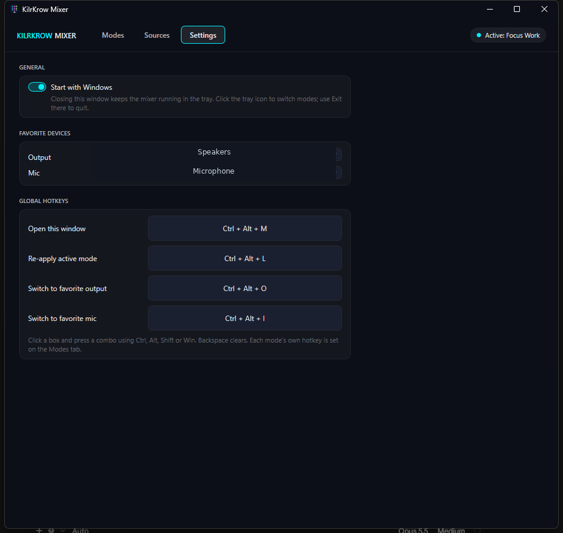
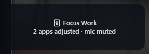
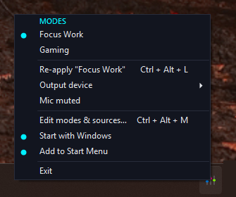

# KilrKrow Mixer

Per-app Windows volume mixer driven by named **modes** and shared **sources**.
Build a mix once (Voice up, Games down, mic muted...), then switch it from the
tray or a hotkey. Lives in the tray; closing the window does not quit.

WPF | `net10.0-windows` | NAudio WASAPI

## Features

- **Modes** - named templates (Focus Work, Gaming, ...) that set per-source
  volume/mute, optional master volume, mic mute, and output device
- **Sources** - reusable app buckets (Voice, Audio, Browser, Games, ...) plus
  built-in System sounds / Everything else; match by process name or install folder
- **Playing now** - live sessions on the default output; assign an app to a source
- **Hotkeys** - open the window, re-apply the active mode, jump to favorite
  output/mic; each mode can have its own chord
- **Tray** - single-click menu to switch modes; Start with Windows (`--tray`);
  Add to Start Menu shortcut
- **Restore on quit** - Exit from the tray restores mic mute, master volume,
  default devices, and session volumes captured at startup (closing the window
  to the tray does not restore)
- **Favorite devices** - one-key switch to a preferred playback/capture endpoint
- **HUD** - brief on-screen confirm when a mode is applied

Config: `%AppData%\KilrKrowAudioMixer\config.json`

Design notes: [docs/DESIGN.md](docs/DESIGN.md)

## Screenshots

### Modes



### Sources



### Settings



### HUD



### Tray



## Requirements

- Windows 10/11
- [.NET 10 SDK](https://dotnet.microsoft.com/download) to build
- Runtime: `net10.0-windows` (desktop)

## Build / run

```bat
cd D:\_dev\audio-mixer
dotnet build -c Release
dotnet run -c Release
```

Publish a framework-dependent folder:

```bat
dotnet publish -c Release -o publish
publish\audio-mixer.exe
```

First launch seeds starter sources (Voice / Audio / Browser / Games) and example
modes (Focus Work / Gaming). Pass `--tray` to start hidden in the tray (used by
Start with Windows).

## Repo layout

| Path | Role |
|---|---|
| `MainWindow.*` | Modes / Sources / Settings builder UI |
| `HudWindow.*` | Apply toast |
| `AudioEngine.cs` | WASAPI sessions, volume/mute, default endpoints |
| `ModeService.cs` | Apply mode + follow new matching sessions |
| `ConfigManager.cs` | JSON config + seed/migrate |
| `HotkeyManager.cs` | Global hotkeys |
| `StartupHelper.cs` | HKCU Run autostart + Start Menu shortcut |
| `docs/DESIGN.md` | Evolution / design notes |

## License

Private KilrKrow project. Not published for general use.