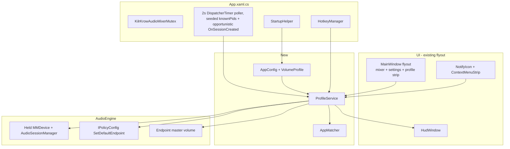
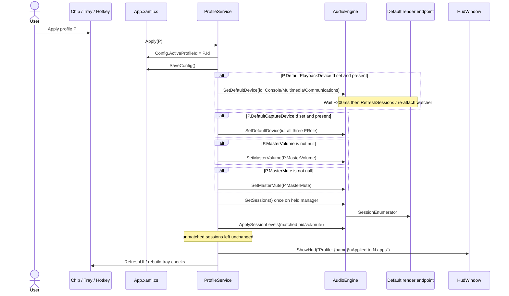
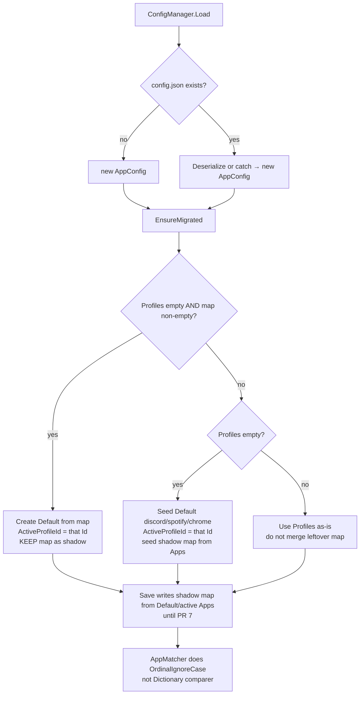

# KilrKrow Mixer — Profile-Based Tray Mixer

| Field | Value |
|---|---|
| **Document** | Design: evolve KilrKrow Audio Mixer into a named-profile tray mixer |
| **Author** | Guy Schamp / KilrKrow |
| **Date** | 2026-09-12 |
| **Status** | Draft (rev 3 — poller seed / STA affinity / PID 0 / Merge defaults) |
| **Repo** | `D:\_dev\audio-mixer` (WPF, `net10.0-windows`, NAudio.Wasapi 2.3.0) |
| **Product name** | KilrKrow Mixer (mutex `KilrKrowAudioMixerMutex`, config `%AppData%\KilrKrowAudioMixer\config.json`) |

This is an in-place evolution of the existing app. It is **not** a greenfield rewrite, not a move to `D:\_dev\vol-snap`, not WinUI 3, and not a C++/Direct2D port. VoltDesk and Sideclip are **pattern sources only** — copy code, do not add project references.

---

## Overview

KilrKrow Mixer is a single-instance WPF tray flyout that lists the default render device’s WASAPI sessions and lets the user star a favorite playback/capture device. Volume “presets” today are one flat `Dictionary<string, float>` (`AppConfig.AppVolumePresets`) applied by `App.ResetVolumeLevels()`. That is not a mixer profile: there is no named mix, no per-profile hotkey, no groups, no Start-with-Windows, and the flyout itself is boxed in a light-gray rectangle with a stock Win11 white scrollbar.

This design replaces the single preset map with a list of **named volume profiles** (Discord mode, Rock-out, …). Each profile owns per-app volumes + mute, optional groups of process names sharing one volume, optional master / system-sounds level, and optional default playback/recording devices. Applying a profile is a **one-shot set** of matching sessions; the applied profile becomes `ActiveProfileId`. While it is active, newly appeared matching sessions also receive the profile’s level. Manual slider moves stay live and do **not** rewrite the profile until the user Save / Update. Share in v1 is a versioned JSON file (no network).

v1 also ships two product-critical tray/chrome items: **Start with Windows** (HKCU Run, copied from VoltDesk / Sideclip) and a **first-class fix** for the transparent-window gray box + white overlay scrollbar.

---

## Background & Motivation

### Current state (what the code actually does)

| Area | Implementation | Path |
|---|---|---|
| Process + mutex | `App.OnStartup` takes `KilrKrowAudioMixerMutex`; second instance MessageBox + `Shutdown()` | `D:\_dev\audio-mixer\App.xaml.cs` |
| Config | `AppConfig` + `ConfigManager` JSON at `%AppData%\KilrKrowAudioMixer\config.json` | `D:\_dev\audio-mixer\ConfigManager.cs` |
| Presets | `Dictionary<string, float> AppVolumePresets` defaulting to discord=1.0, spotify=0.5, chrome=0.6; keys re-wrapped with `StringComparer.OrdinalIgnoreCase` on load | same |
| Engine | NAudio `MMDeviceEnumerator`; sessions **only** on `GetDefaultAudioEndpoint(DataFlow.Render, Role.Multimedia)`; `SetSessionVolume` / `SetSessionMute` match **PID only**; expired sessions (`State == 2`) and `Idle` skipped | `D:\_dev\audio-mixer\AudioEngine.cs` |
| Device switch | `IPolicyConfig.SetDefaultEndpoint` via `PolicyConfigClient` | `D:\_dev\audio-mixer\IPolicyConfig.cs` |
| Flyout | 380×540, `WindowStyle="None"`, `AllowsTransparency="True"`, `Background="Transparent"`, `Grid Margin="10"`, `WindowBorder` `DropShadowEffect`, deactivate-to-hide, 1200 ms `DispatcherTimer` poller **only while visible** | `MainWindow.xaml` / `MainWindow.xaml.cs` |
| Acrylic | `DwmSetWindowAttribute(hwnd, DWMWA_SYSTEMBACKDROP_TYPE=38, value=3)` (Acrylic) on a layered window | `MainWindow.ApplyAcrylicBlur()` |
| Hotkeys | Fixed set of 4: toggle mixer, fav out, fav in, reset presets. `HotkeyManager` auto-increments ids from 1, `UnregisterAll` resets | `HotkeyManager.cs`, `App.RegisterGlobalHotkeys()` |
| Tray | `NotifyIcon` + `ContextMenuStrip`: Open Mixer, Reset App Volume Levels, Exit. No profile submenu, no autostart | `App.InitializeTrayIcon()` |
| HUD | `HudWindow.ShowHud` — 300×110 layered window, also uses `DropShadowEffect` | `HudWindow.xaml` |
| Look | Obsidian `#0c0f17` + neon cyan/magenta in `Styles.xaml`. `GlassScrollBar` exists **but is unused**. ComboBox popup also `AllowsTransparency` + `DropShadowEffect` | `Styles.xaml` |

`ResetVolumeLevels()` walks `AudioEngine.GetSessions()` and, for each session whose `ProcessName` hits `AppVolumePresets`, calls `SetSessionVolume`. There is no mute in the map, no groups, no master volume API, no session-created hook, and no persistence of “which mix is active.”

### Pain points

1. **One mix only.** Switching from “Discord at 100%, music at 30%” to “music at 100%, Discord at 20%” means hand-dragging sliders or editing the one dictionary.
2. **Presets do not follow new sessions.** The 1200 ms poller in `MainWindow` only runs while the flyout is open (`ShowMixer` starts it, `HideMixer` stops it). Launching Discord after applying presets does nothing unless the user hits Reset again.
3. **No Start with Windows.** VoltDesk (`StartupHelper.cs`) and Sideclip (`SettingsManager.ApplyAutostart` + tray checkbox) already solved this; the mixer has neither the HKCU Run write nor the tray checkbox.
4. **Chrome bug is shipping.** Screenshot `C:\Users\guysc\OneDrive\Pictures\Screenshots\Screenshot 2026-09-12 181020.png` shows a light-gray rectangular “window box” around the rounded glass card, plus an unstyled white Win11 overlay scrollbar punching a hole in the glass. Root cause is analyzed in [Flyout chrome](#flyout-chrome).
5. **Engine is poll-and-dispose.** Every `GetSessions` / `SetSessionVolume` constructs a new `MMDeviceEnumerator`, opens the default render endpoint, and disposes it. That makes `IAudioSessionNotification` impossible (the session manager dies with the device) and makes applying a 12-app profile open the endpoint 12+ times.

### Why evolve in place

The glass flyout, `AudioEngine`, `IPolicyConfig` device switch, `HotkeyManager`, HUD, and config path are the product. Rewriting in WinUI 3 or moving to `vol-snap` would throw away the look and the WASAPI glue for no v1 gain. “Sexy like TMOG” here means denser instrument-like polish of **this** flyout (spacing, chrome, profile strip) — not a new renderer.

---

## Goals & Non-Goals

### Goals (v1)

- Named volume profiles with CRUD in the flyout settings panel and a tray submenu.
- Per-profile hotkeys (VoltDesk `PowerProfileHotkey` shape), registered through the existing `HotkeyManager`.
- One-shot apply + `ActiveProfileId` + apply-on-new-matching-session.
- Per-app volume + mute; named **groups** of process names with one volume; per-app entries override groups.
- Optional master (endpoint) volume and System Sounds session volume; optional default playback/capture device (reuse `SetDefaultDevice`).
- Capture current mix → new profile; explicit Save / Update (sliders never auto-write the profile).
- JSON import/export of one profile or a pack; no network.
- Start with Windows (HKCU `Software\Microsoft\Windows\CurrentVersion\Run`).
- Fix the gray window box and white scrollbar as a first-class v1 item.
- Keep KilrKrow glass (obsidian + neon cyan/magenta, rounded flyout).
- Keep single-instance mutex and `%AppData%\KilrKrowAudioMixer\config.json`.

### Non-goals (v1)

- Per-app device routing (EarTrumpet drag-drop).
- Peak meters.
- Auto-switch profile on foreground app.
- Enumerating sessions on non-default endpoints (documented limitation; profiles that switch default device **do** re-enumerate after the switch).
- Distinct volumes for multiple sessions of the same PID (today `SetSessionVolume` already sets all sessions for that PID — keep that).
- Pre-setting volume for apps that have **no** session yet, except via ActiveProfileId + apply-on-create.
- Microsoft Store pipeline, telemetry, network/gist sharing.
- Repo move, rename-as-a-project, WinUI 3, C++/Direct2D.
- Start Menu shortcut (VoltDesk has `ApplyStartMenuShortcut`; we do **not** port it).
- Project references to VoltDesk or Sideclip.

---

## Proposed Design

### Architecture

Keep the flat `audio_mixer` namespace and WPF app model. Add a small number of types; do not introduce a DI container.



**New files (all under `D:\_dev\audio-mixer`, namespace `audio_mixer`):**

| File | Responsibility |
|---|---|
| `StartupHelper.cs` | Port of VoltDesk `StartupHelper.ApplyStartOnWindows` / `IsStartOnWindows`. Registry value name `KilrKrowAudioMixer`. |
| `ProfileService.cs` | Apply, capture, update-from-mix, `ParsePack`/`Merge`/`Export` (no UI), poller + live-session follow. |
| `AppMatcher.cs` | Process-name / exe-suffix / display-name matching + group vs app precedence. |
| Models stay in `ConfigManager.cs` | `VolumeProfile`, `ProfileAppEntry`, `ProfileGroup`, `ProfilePack` next to existing `AppConfig`. |

`App.xaml.cs` remains the composition root: owns `AudioEngine`, `AppConfig`, `HotkeyManager`, tray, the **always-on 2 s `DispatcherTimer` poller** (seed `knownPids` first, no apply), and `AudioEngine.Dispose()` on exit. The flyout-only 1200 ms `DispatcherTimer` stays UI-only.

### Data model

Replace

```csharp
// ConfigManager.cs today
public Dictionary<string, float> AppVolumePresets { get; set; } = new(StringComparer.OrdinalIgnoreCase)
{
    { "discord", 1.0f },
    { "spotify", 0.5f },
    { "chrome", 0.6f }
};
```

with the types in [Data Model Changes](#data-model-changes). Summary:

- `AppConfig.Profiles : List<VolumeProfile>`
- `AppConfig.ActiveProfileId : string?`
- `AppConfig.StartWithWindows : bool`
- `AppConfig.SchemaVersion : int` (= 1)
- `VolumeProfile` owns `Apps`, `Groups`, optional `MasterVolume`, optional `DefaultPlaybackDeviceId` / `DefaultCaptureDeviceId`, optional `Hotkey`
- Favorite-device fields and the four **app** hotkeys (toggle mixer / fav out / fav in / re-apply active) stay

`AppVolumePresets` remains on `AppConfig` as a **migration source and, until PR 7, a shadow copy for rollback**. It is never a write target for UI. `EnsureMigrated` (see [Config load / migration](#config-load--migration)) is the single function that turns a missing/empty `Profiles` list into a Default profile. Until PR 7, `Save` flattens Default (else active) `Apps` into the map so a reverted pre-PR2 binary still `TryGetValue`s. PR 7 nulls the map and stops writing it.

### App matching

`AudioSession.ProcessName` is `Process.ProcessName` (no `.exe`, original case, e.g. `"Discord"`, `"chrome"`). Preset keys today are lowercase and compared with `OrdinalIgnoreCase` — keep that.

**Normalize** before compare:

1. Trim.
2. If the value ends with `.exe` (any case), strip the extension (`Path.GetFileNameWithoutExtension`).
3. Compare with `StringComparison.OrdinalIgnoreCase`.

**`AppMatcher.Resolve(AudioSession session, VolumeProfile profile) -> ProfileAppEntry?`** (synthetic entry for a group hit):

1. Walk `profile.Apps` in list order. A hit requires:
   - normalized `ProcessName` equality, **and**
   - if `ExePathSuffix` is set: `session.ProcessPath` ends with that suffix (`OrdinalIgnoreCase`), **and**
   - if `DisplayNameContains` is set: `session.DisplayName` contains that substring (`OrdinalIgnoreCase`).
2. If no app hit, walk `profile.Groups` in list order. A hit is membership of the normalized process name in `group.ProcessNames` (each name normalized the same way).
3. First hit wins. App entries always beat groups. Unmatched sessions are **left unchanged**.
4. `processId == 0` / `ProcessName` of `"System Sounds"` / `"System Sound"` matches an app entry or group member named `System Sounds` (canonical name). This is how “system at 10%” is stored if the user means the System Sounds session rather than endpoint master.

Keep the matcher boring. No regex, no glob, no publisher/hash. Discord vs DiscordPTB is data: two process names, or one name plus `ExePathSuffix` (`\Discord\`, `\DiscordPTB\`).

**Built-in starter groups are data, not magic.** They live as a static `ProfileGroupTemplates.All` array in `AppMatcher.cs` (or `ProfileService.cs`) and appear in the settings “Add group” dropdown. They are copied **into** a profile when the user picks them. Matching never consults the template list at apply time.

v1 templates:

| Name | ProcessNames |
|---|---|
| Music | `spotify`, `musicbee`, `vlc`, `foobar2000`, `itunes`, `applemusic`, `wmplayer`, `groove` |
| Chat | `discord`, `discordptb`, `slack`, `teams`, `ms-teams`, `zoom`, `skype` |
| Browser | `chrome`, `firefox`, `msedge`, `brave`, `opera`, `vivaldi` |

Do **not** seed Music + Browser into the same default profile (chrome would be ambiguous; first group wins). The migrated “Default” profile has **no** groups — only the old per-app map.

### Profile apply semantics (locked)



Rules:

- Apply is **one-shot** against sessions that exist on the (possibly just-switched) default multimedia render endpoint.
- Unmatched apps are not touched.
- Manual mixer slider / mute changes call `AudioEngine.SetSessionVolume` / `SetSessionMute` only. They do **not** write `VolumeProfile.Apps`.
- **Save / Update profile** (mixer strip button + settings action) snapshots the current mix **into the active/selected profile** (see Capture).
- **New profile from current mix** creates a new `VolumeProfile` and selects it; it does not have to apply it.
- While `ActiveProfileId` points at P, a newly created matching session is set to P’s level (so Discord launched after Discord-mode still hits 100%).
- On process start of KilrKrow Mixer: restore `ActiveProfileId` for tray checkmark and for apply-on-create. **Do not** blast-apply existing sessions at login. The user re-applies via chip / tray / per-profile hotkey / “Re-apply active profile.” (If we later want apply-at-login, that is a separate flag — see Open Questions.)

Device IDs that are missing (unplugged) are skipped with a HUD line; volumes/groups still apply.

Role coverage: profile device apply sets **all three** `ERole` values (`Console`, `Multimedia`, `Communications`), matching `App.SwitchToFavoriteOutput`. Today the combos diverge: `ComboPlayback_SelectionChanged` is Multimedia + Console only (`MainWindow.xaml.cs` 219–220); `ComboRecording_SelectionChanged` is Multimedia + Communications only (230–231). PR 3 unifies **both** combos to all three roles so the UI and profiles do not diverge.

### Apply-on-new-session

Today `MainWindow._refreshTimer` (1200 ms) only runs while the flyout is visible. That cannot implement ActiveProfileId follow.

This is a WPF **STA** app. MSDN requires `CoInitializeEx(NULL, COINIT_MULTITHREADED)` for `IAudioSessionManager2::RegisterSessionNotification`. `MainWindow.RefreshAppSessionsList` uses `Task.Run` only for a one-shot `GetSessions()` (create/use/dispose on a pool thread). A pool `Task.Run` is **not** a process-lifetime MTA: the thread returns to the pool and the RCWs are left without an owner. Do **not** “subscribe on MTA (`Task.Run` already used…)”. v1 does **not** add a dedicated MTA owner thread (option B).

**Guaranteed path (option A, locked):** always-on **2 s `DispatcherTimer` PID-diff poller**, started in `App.OnStartup` regardless of whether `OnSessionCreated` subscribed. Process-lifetime, not flyout-lifetime. UI-thread only (see thread affinity below). “Never fires” cannot be detected at subscribe time; if the event is wired but WASAPI delivers nothing (the likely STA outcome), the poller is still running. The existing 1200 ms flyout timer stays a **UI refresh** (slider positions) and is not the apply mechanism.

An empty `HashSet<uint>` on the first tick would make every already-running session “new” and **blast-apply at login**, violating the locked rule. The algorithm is:

1. After `StartWatching()`, on the UI thread: `knownPids = GetSessions().Select(s => s.ProcessId)` as a `HashSet<uint>`. **Do not** call `OnNewSessions`. This seed is what makes “no blast-apply at login” true.
2. Each poll tick (same dispatcher): `current = GetSessions()`; `appeared = current.Where(s => !knownPids.Contains(s.ProcessId))`; if `appeared` is non-empty, `OnNewSessions(appeared)`; then **`knownPids = current.Pids` (replace, not union)** so departed PIDs can be reused later without being treated as already-seen forever.
3. On `RebindDefaultRender` / `OnDefaultDeviceChanged`: replace `knownPids` with the **new** endpoint’s current PIDs. Do **not** treat that whole list as appeared. `ProfileService.Apply` already one-shots matching sessions after its own rebind; a combo/OS device switch is not an Apply and must not mass-apply the active profile onto the new endpoint.

`ProfileService` owns `knownPids`. `App` owns the `DispatcherTimer`. Event-path `ApplyToLiveSession` should `knownPids.Add(pid)` after a successful match so the next poll does not double-apply.

**Opportunistic path:** hold the default render `MMDevice` + `AudioSessionManager` and subscribe to NAudio.Wasapi 2.3.0’s **public event** `AudioSessionManager.OnSessionCreated` (`void SessionCreatedDelegate(object sender, IAudioSessionControl newSession)`). NAudio’s `AudioSessionNotification` wrapper is **internal** — app code uses the event, not a homemade `IAudioSessionNotification`. `StartWatching` must:

1. Hold default render `MMDevice` (do not dispose per call).
2. `sessionManager.OnSessionCreated += …`
3. Force `var _ = sessionManager.Sessions.Count` after subscribe. NAudio’s ctor already calls `RefreshSessions()` → `GetSessionEnumerator` + `RegisterSessionNotification`, but it does **not** call `IAudioSessionEnumerator.GetCount`. `SessionCollection.Count` is what calls `GetCount`. MSDN: notifications are discarded until `GetCount` runs **after** register.
4. Callback: wrap with `new AudioSessionControl(newSession)`, read `GetProcessID`, resolve names with the **same mapping as `GetSessions`** (see PID 0 below), run `AppMatcher`. **Set volume/mute on that `AudioSessionControl.SimpleAudioVolume`**, not via a fresh `GetSessions()` / `ApplySessionLevels`. MSDN: “The session enumerator might not be aware of the new sessions that are reported through `IAudioSessionNotification`.” Re-enumerate is the poller path only.
5. Marshal to `Application.Current.Dispatcher` before touching UI/config/`knownPids`.

**PID 0 / System Sounds on the event path:** `GetSessions` already special-cases `processId == 0` and does **not** call `Process.GetProcessById` (that throws). `ApplyToLiveSession` uses the same mapping:

- `processId == 0`, or session display name `"System Sounds"` / `"System Sound"` → canonical `ProcessName = "System Sounds"`. Do **not** call `GetProcessById`.
- `processId != 0`: `GetProcessById` for name/path. If that throws, apply the same display-name fallback as `GetSessions` (`session.DisplayName` → System Sounds if it looks like one); **otherwise skip**. Never skip PID 0 just because lookup throws.

**Thread affinity (locked):** `_enumerator` / `_defaultRender` / `_sessionManager` are created on the WPF UI thread in `App.OnStartup`. `GetSessions` / `SetSessionVolume` / `SetSessionMute` / `ApplySessionLevels` / master getters/setters / poller ticks **run on that dispatcher**. Use `DispatcherTimer` (2 s), **not** `System.Threading.Timer` / `System.Timers.Timer` / pool `Task.Run`. PR 3 **removes** the existing `await Task.Run(() => _engine.GetSessions())` in `MainWindow.RefreshAppSessionsList` (today’s comment: “Enumerate sessions on MTA background thread to prevent STA omissions”) and calls `GetSessions()` on the UI thread. After the manager is STA-owned, that `Task.Run` is a cross-apartment RCW call, not a fix.

Holding the enumerator on STA may revive WASAPI “STA omissions” (sessions missing from the flyout). That is a PR 3 engine bug to fix if it shows up — **not** a silent resurrection of `Task.Run`. QA: every playing app on the default render device still appears in the flyout after the hold.

**Default-device changes:** NAudio 2.3.0 has `MMDeviceEnumerator.RegisterEndpointNotificationCallback`. There is **no** public `MMNotificationClient` helper in the 2.3.0 XML. Implement a **private** `IMMNotificationClient` on `AudioEngine`, store the instance in a field (GC root — otherwise callbacks silently stop), register/unregister it. On `OnDefaultDeviceChanged` for render/multimedia: marshal to the dispatcher, detach the old session manager, attach to the new default render, force `Sessions.Count`, **replace `knownPids`** with the new endpoint’s current PIDs (no mass `OnNewSessions`). If the active profile itself caused the switch, `ProfileService.Apply` already one-shots after rebind.

**Shutdown:** `App.OnExit` today does not dispose `AudioEngine`. PR 3 adds `AudioEngine.Dispose()` there: stop the `DispatcherTimer`, unregister session + endpoint callbacks, dispose `_defaultRender` / `_enumerator`. Holding COM notifications without that is how tray apps hang on Exit.

PID reuse: never treat a cached PID as a stable identity across minutes. Replace `knownPids` each tick (step 2) so a recycled PID of a **new** process is “appeared” again. Matcher uses live `ProcessName`/`ProcessPath`. Skip only when `processId != 0` and `GetProcessById` throws without a System Sounds fallback.

### Capture current mix

Public names (one pair, used everywhere — there is no `CaptureCurrentMix`):

- `ProfileService.CreateFromCurrentMix(string name, bool includeMaster, bool includeDevices) -> VolumeProfile`
- `ProfileService.UpdateFromCurrentMix(string profileId, bool includeMaster, bool includeDevices)`

Behavior:

- Enumerate sessions once via the held manager.
- Collapse by normalized process name (multiple sessions per process → first session’s volume/mute; they are already forced equal by `SetSessionVolume`).
- Skip `Idle`. Include `System Sounds` as an `Apps` entry when present.
- `MasterVolume`: written only if `includeMaster` (settings checkbox, default **off** so capture does not clobber endpoint volume by accident).
- `MasterMute`: **never written by capture in v1** (stays `null`). No capture checkbox.
- `DefaultPlaybackDeviceId` / `DefaultCaptureDeviceId`: written only if `includeDevices` (default **off**).
- Groups are **not** inferred. Capture writes per-app entries. The user can later fold apps into a group in the editor.
- New profile: `Id = Guid.NewGuid().ToString("N")`, `Hotkey = null`.
- **Update** path: overwrite `Apps` (and optionally `MasterVolume` / devices) of an existing profile; keep `Id`, `Name`, `Hotkey`, `Groups`, and existing `MasterMute`. Updating does not delete groups; per-app capture entries override those groups at apply time, which is the locked precedence.

**Apply vs mute:** if `VolumeProfile.MasterMute` is non-null (hand-edited JSON or a future UI), `Apply` **does** call `SetMasterMute`. v1 settings UI is master **volume** only — no mute checkbox — so the field stays null for UI-created profiles. Ignoring a persisted non-null on apply would be the bigger surprise.

### Engine changes (`AudioEngine.cs`)

The current “open, enumerate, dispose” pattern cannot host notifications and is too expensive for profile apply.

Hold for process life (fields on `AudioEngine`):

```csharp
private MMDeviceEnumerator? _enumerator;
private MMDevice? _defaultRender;
private AudioSessionManager? _sessionManager;
private IMMNotificationClient? _endpointClient; // private impl, GC-rooted
```

`GetSessions`, `SetSessionVolume`, `SetSessionMute`, `ApplySessionLevels`, and master-volume getters/setters **all** go through `_sessionManager` / `_defaultRender` only. Do **not** construct a second enumerator for the default render (today every slider `ValueChanged` opens a new `AudioSessionManager`, whose ctor `RefreshSessions()` would `RegisterSessionNotification` on a second manager for the same endpoint). `GetDevices()` may use a **short-lived** enumerator and **must not** dispose `_defaultRender`.

New public surface (see [API / Interface Changes](#api--interface-changes)):

- `StartWatching()` / `Dispose()` — bind held device, `OnSessionCreated`, `Sessions.Count` pump, private `IMMNotificationClient`. Called from `App.OnStartup` / `App.OnExit`.
- `GetMasterVolume()` / `SetMasterVolume(float)` / `GetMasterMute()` / `SetMasterMute(bool)` via `_defaultRender.AudioEndpointVolume.MasterVolumeLevelScalar` / `.Mute`.
- `ApplySessionLevels(IReadOnlyList<SessionLevelChange>)` — one pass on the held session collection. Used by full profile apply and by the poller path.
- `RebindDefaultRender()` — after `SetDefaultDevice`, wait ~200 ms **on the dispatcher** (e.g. `await Task.Delay(200)` then continue on `Dispatcher`; do not resume on a pool thread), swap `_defaultRender` / `_sessionManager`, force `Sessions.Count`, return `GetSessions()`. Retry at 200/400 ms until the default ID matches. Caller then **replaces** `knownPids` from that list (no `OnNewSessions` unless this is `ProfileService.Apply`, which one-shots via `ApplySessionLevels` and still replaces `knownPids` afterwards).

`App.OnStartup` **always** starts the 2 s `DispatcherTimer` poller after `StartWatching()` **and after seeding `knownPids`** (no apply on the seed), even if the event subscribed cleanly.

**Limitation to document in the mixer UI** (tooltip on the session list header): *“App volumes are for the current default playback device. Apps playing to another device are hidden.”* v1 keeps this. Profiles that set a default playback device re-enumerate after the switch, so their per-app levels apply to sessions that land on the **new** default.

Inactive/expired sessions remain skipped (`State == 2`). Apps not currently playing cannot be pre-set except via ActiveProfileId + apply-on-create.

### Flyout chrome

#### Screenshot evidence

`C:\Users\guysc\OneDrive\Pictures\Screenshots\Screenshot 2026-09-12 181020.png` (2026-09-12, settings panel):

- The rounded glass card looks correct (obsidian, cyan “KILRKROW MIXER”, magenta/cyan sliders).
- A **light-gray opaque rectangle** sits around the card, larger than the `CornerRadius="16"` body — the layered window’s HWND is showing through.
- A **stock Win11 white overlay scrollbar** sits on the right edge of that rectangle, not on the glass.

#### Root cause (two stacked bugs)

`MainWindow.xaml`:

```xml
WindowStyle="None"
AllowsTransparency="True"
Background="Transparent"
```

```xml
<Grid Margin="10">
  <Border x:Name="WindowBorder" CornerRadius="16" Background="#df0c0f17" ...>
    <Border.Effect>
      <DropShadowEffect Color="#000000" BlurRadius="15" ShadowDepth="2" Opacity="0.5"/>
    </Border.Effect>
```

1. **`DropShadowEffect` on a layered window.** WPF bitmap effects dirty the **window rectangle**, not the rounded geometry. On Win11 layered HWNDs, pixels that XAML considers “transparent” often composite as a gray/white box. `Grid Margin="10"` exists specifically to give the 15 px blur room — that margin **is** the box.
2. **`DWMWA_SYSTEMBACKDROP_TYPE = 3` (Acrylic) on an `AllowsTransparency` window** (`MainWindow.ApplyAcrylicBlur`). Mica/Acrylic want an opaque HWND. Combined with per-pixel alpha they fill the entire window rect (including the 10 px margin) with a rectangular backdrop.

Secondary: `Styles.xaml` ComboBox popup (`AllowsTransparency="True"` + `DropShadowEffect` on `DropDownBorder`) will show the same halo under every device dropdown. `HudWindow.xaml` uses the same DropShadow pattern.

`GlassScrollBar` / `ScrollBarThumb` are already defined in `Styles.xaml` (lines 247–288) and **never applied**. `ScrollViewer` instances in `MainWindow.xaml` (mixer list + settings) use the default template, which on Win11 is the overlay scrollbar — a white slab.

#### Recommended fix (do this)

Keep `AllowsTransparency="True"` and the rounded glass card. Do **not** make the window opaque or square.

1. **Delete** `WindowBorder`’s `DropShadowEffect`. Delete `HudWindow`’s `DropShadowEffect`. Delete the ComboBox `DropDownBorder` `DropShadowEffect`.
2. **Stop calling** `ApplyAcrylicBlur()` (or pass `DWMWA_SYSTEMBACKDROP_TYPE = 1` / None). The XAML fill `#df0c0f17` is the glass; DWM acrylic fights layered windows.
3. Window attributes:

```xml
<Window ...
        AllowsTransparency="True"
        Background="#00000000"
        UseLayoutRounding="True"
        SnapsToDevicePixels="True">
```

In `MainWindow_Loaded`, after `EnsureHandle`:

```csharp
var src = HwndSource.FromHwnd(new WindowInteropHelper(this).Handle);
if (src?.CompositionTarget != null)
    src.CompositionTarget.BackgroundColor = Colors.Transparent;
```

4. **True-alpha shadow** as a larger outer `Border`/`Rectangle`, `IsHitTestVisible="False"`. No bitmap effect. Preferred implementation: 4 concentric `Border`s (no extra assets):

```xml
<Grid>
  <Border CornerRadius="22" Margin="2" Background="#14000000" IsHitTestVisible="False"/>
  <Border CornerRadius="20" Margin="4" Background="#18000000" IsHitTestVisible="False"/>
  <Border CornerRadius="18" Margin="7" Background="#22000000" IsHitTestVisible="False"/>
  <Border CornerRadius="16" Margin="10"
          Background="#df0c0f17"
          BorderBrush="#25ffffff"
          BorderThickness="1"
          x:Name="WindowBorder">
    <!-- existing grid -->
  </Border>
</Grid>
```

Optional later polish: replace the concentric borders with a 9-slice PNG that actually contains transparent pixels. Not required for v1.

5. **Glass `ScrollViewer`.** The existing `GlassScrollBar` (`Styles.xaml` 270–288) is **vertical-only**: `Width="8"`, `Track.IsDirectionReversed="True"`. An implicit template that only hosts `PART_VerticalScrollBar` will clip or ignore the PR 6 chip strip (horizontal). PR 1 therefore ships a **complete** `ScrollViewer` `ControlTemplate` with both bars:

   - `GlassScrollBar` — vertical, `Width="8"`, `IsDirectionReversed="True"` (already written).
   - `GlassScrollBarHorizontal` — `Height="8"`, `IsDirectionReversed="False"`, same thumb colors.
   - Template hosts `PART_ScrollContentPresenter`, `PART_VerticalScrollBar` (visibility `ComputedVerticalScrollBarVisibility`), and `PART_HorizontalScrollBar` (visibility `ComputedHorizontalScrollBarVisibility`).

   Apply as implicit `Style TargetType="ScrollViewer"` so mixer list, settings, ComboBox popup, and later the chip strip all get it. Thin, dark, `BrushBorderGlass`-adjacent. No arrows. This bypasses the Win11 overlay scrollbar.

6. Inner `DropShadowEffect`s on **slider thumbs / favorite star / neon track glow** stay for v1 (they are small visuals inside an already-opaque card). If a machine still shows a gray box after steps 1–5, stripping those inner effects is the diagnostic next step — not the first.

#### Fallbacks (only if the gray box remains after the recommended fix)

| Order | Fallback | Cost |
|---|---|---|
| A | `RenderOptions.ProcessRenderMode = RenderMode.SoftwareOnly` (app-wide) or per-HwndSource `RenderMode.SoftwareOnly` | Fixes some GPU/DWM compositors; uses more CPU; try **per-window** first |
| B | Drop `AllowsTransparency`, use `WindowChrome` + `DwmSetWindowAttribute(DWMWA_WINDOW_CORNER_PREFERENCE = 2)` (round) + mica | Loses per-pixel alpha; corners are OS-rounded; **last resort** because the rounded glass **is** the product |

Do **not** “fix” this by making the window opaque/square.

#### ComboBox popup

Same treatment: keep `AllowsTransparency="True"` on the `Popup`, remove `DropShadowEffect`, give `DropDownBorder` a 1 px `#25ffffff` border and the glass `ScrollViewer`. Margin currently `0,2,0,4` can stay as a gap, not as shadow padding.

### Mixer UI

Keep 380 px width. Grow height **380×580** (from 540) to make room for a profile strip without crushing session rows. Update the `PositionWindowNearTray` comment that still says `Height = 540`; the method already uses `this.Height` / `this.Width` for the working-area math. Tighter padding: session row `Padding="10,6"` (was `10,8`), device card `Padding="10"` (was 12). No meters.

**Profile strip** — new row between the titlebar separator and the device card (`PanelMixer` gains a row):

- Horizontal `ScrollViewer` (`HorizontalScrollBarVisibility="Auto"`, vertical disabled) using the PR 1 template (`PART_HorizontalScrollBar` + `GlassScrollBarHorizontal`).
- Chip **`Button`s**, not `ToggleButton`. A `ToggleButton` unchecks itself on a second click and fights `Id == ActiveProfileId`. Style the `Button` as a chip; after apply, restyle from `ActiveProfileId` (cyan border iff match). There is no “no profile” chip in v1.
- Active chip (`Id == ActiveProfileId`): 1 px `BrushNeonCyan` border, `#15ffffff` fill.
- Inactive: `BrushBorderGlass` border, transparent fill.
- Click = `ProfileService.Apply`.
- Trailing ghost chip `+` opens settings on the editor with “New profile from current mix” pre-selected, or runs that action directly if the list is empty.
- Small glass icon button on the strip: **Update active from current mix** (tooltip). Disabled if no active profile.

Chip apply must **not** hide the flyout. `HudWindow` is shown with `ShowActivated="False"` (PR 1); do not treat the HUD as a `_hideSuppression` client.

Session rows unchanged in behavior (live volume, mute). They do not write the profile.

Tooltip on the session list: default-device-only limitation.

### Settings UI

Replace the “FAVORITE VOLUME PRESETS” block (`MainWindow.xaml` lines 265–283 and `RefreshPresetsUI` / `BtnAddPreset_Click`) with a **Profiles** section. Keep Favorite Devices summary and Global Hotkeys.

Settings layout (still inside the flyout `PanelSettings` `ScrollViewer`):

1. **Favorite devices** — unchanged.
2. **Global hotkeys** — unchanged three device/mixer keys; relabel `TxtHotkeyResetLevels` from “Reset Volume Presets” to **“Re-apply Active Profile”**. Same `PreviewKeyDown` pattern (`HotkeyTextBox_PreviewKeyDown`).
3. **Start with Windows** — glass checkbox bound to `AppConfig.StartWithWindows`; on change call `StartupHelper.ApplyStartOnWindows` + `SaveConfig`. Also present on the tray (source of truth is the config flag; registry is the effect).
4. **Profiles**
   - List of profiles (name + hotkey caption). Selected item drives the editor below.
   - Buttons: **Add**, **From current mix**, **Duplicate**, **Delete**.
     - `Duplicate` copies Apps/Groups/master/devices, new `Id`, name `"Copy of {Name}"`, **`Hotkey = null`** (copying the chord would collide on every `RegisterGlobalHotkeys`).
     - `Delete`: if this is the last profile, return false and mutate nothing. If it is the active profile, set `ActiveProfileId` to the next remaining neighbor (index `i+1`, or `i-1` when deleting the last index), save, **do not** auto-`Apply` (same as no blast-at-login). `ProfileService.Delete` does this itself; the UI does not pre-switch.
   - Editor for selected:
     - Name `TextBox`.
     - Hotkey capture `TextBox` (`IsReadOnly`, `PreviewKeyDown` — **same handler family** as the four global keys). Backspace/Delete clears. Empty = no profile hotkey.
     - Checkbox + slider **Set master volume** (`float?`; unchecked ⇔ null). No master-mute checkbox in v1.
     - Checkbox **Set playback device** + combo of current render devices (empty = don’t touch). Same for capture.
     - **Groups** editor: name, comma-separated process names, volume slider, mute, delete. “Add group” dropdown includes `ProfileGroupTemplates` then “Custom”.
     - **Apps** editor: process name, optional expander for `ExePathSuffix` / `DisplayNameContains`, volume, mute, delete. “Add from active session” combo (today’s `ComboAddPreset`).
     - **Update from current mix** for this profile.
     - **Export** this profile / **Import** (file dialogs).

`Window_Deactivated` currently always `HideMixer()`. File dialogs and `MessageBox` will fire `Deactivated` and hide the flyout under the dialog. Introduce `_hideSuppression` (`int` counter) and `IDisposable SuppressHide()` on **`MainWindow`** — not on `ProfileService`. `Window_Deactivated` no-ops when the counter > 0. `MainWindow` (or `App`) owns Open/Save dialogs, collision `MessageBox`es, and the using-`SuppressHide` scope, then calls `ProfileService.ParsePack` / `Merge`. The HUD is **not** a suppression client; it is non-activating (`ShowActivated="False"`).

**PR 2–6 adapter (one store):** until the PR 7 editor ships, the existing “FAVORITE VOLUME PRESETS” UI (`RefreshPresetsUI`, `BtnAddPreset_Click`, preset sliders) reads and writes **`Profiles` of the Default profile** (name `"Default"`, else `Profiles[0]`). Slider/add/delete mutate that profile’s `Apps`, then `SaveConfig`. `Save` shadow-writes `AppVolumePresets` **from that list** (processName → volume; mutes dropped, groups ignored). The UI must **not** write the map directly. `ResetVolumeLevels` (PR 2–3) reads Active if set, else Default `Apps`. After PR 4 it is `ReapplyActive`.

### Tray

Rebuild the menu to match VoltDesk’s checked profile submenu + Sideclip’s autostart checkbox. No project references; port the pattern.

```
Open Mixer
───────────
Profiles ►
  ● Discord mode        Ctrl+Alt+1
    Rock-out            Ctrl+Alt+2
    Default
Re-apply Active Profile
───────────
Start with Windows  ☑
───────────
Exit
```

Implementation notes from the siblings:

- VoltDesk `TrayApplicationContext.ContextMenu_Opening` → `BuildProfileMenuItems()` so checks are live (`PowerManager.GetProfiles()` / `IsActive`). Do the same: on `ContextMenuStrip.Opening`, rebuild the Profiles dropdown from `Config.Profiles`, `Checked = (p.Id == Config.ActiveProfileId)`, `CheckOnClick = false`.
- Sideclip `TrayService`: `ToolStripMenuItem("Start with Windows") { Checked = settings.Autostart, CheckOnClick = true }` then persist. On Opening, set `Checked = Config.StartWithWindows` **only**. Do not read the registry to decide the check. Config is the source of truth; the registry is the effect. Registry-only edits (user deleted the Run value in regedit) are overwritten on the next launch — see [Start with Windows](#start-with-windows).
- Click profile item → `ProfileService.Apply` + HUD (existing `HudWindow.ShowHud`, not balloon tips).
- Remove the old “Reset App Volume Levels” label; replace with “Re-apply Active Profile” (same as the hotkey).
- Left-click tray icon still `ToggleMixerWindow()`.

`App.InitializeTrayIcon()` stays in `App.xaml.cs` (no new `TrayService` class required). Extracting one is optional and not worth a PR of its own.

### Hotkeys

`HotkeyManager` already supports N registrations (`_currentId++`, dictionary of callbacks). `RegisterGlobalHotkeys` currently registers exactly four. Change:

```csharp
_hotkeyManager.UnregisterAll();
Register(_config.ToggleMixerHotkey, ToggleMixerWindow);
Register(_config.FavoriteOutputHotkey, SwitchToFavoriteOutput);
Register(_config.FavoriteInputHotkey, SwitchToFavoriteInput);
Register(_config.ResetLevelsHotkey, ReapplyActiveProfile);

foreach (var profile in _config.Profiles)
{
    if (profile.Hotkey is { Key: not Key.None })
    {
        var captured = profile; // closure
        var ok = _hotkeyManager.Register(
            captured.Hotkey.Modifiers,
            captured.Hotkey.Key,
            () => _profileService.Apply(captured.Id));
        if (!ok) failed.Add(captured.Name);
    }
}
```

Collision handling:

- Before register, scan for duplicate `(Modifiers, Key)` across the four app keys + all profile keys. Duplicates: keep the first, skip the rest, HUD `"Hotkey {chord} already used ({name})"`.
- `RegisterHotKey` failing (another app owns it): skip + HUD. Do not crash.
- Empty / `Key.None` profile hotkeys are not registered.
- Re-register on every settings save (already the pattern after `HotkeyTextBox_PreviewKeyDown`).

Do **not** change `HotkeyManager` to string chords (VoltDesk does `"Ctrl+Shift+D"`). Stay on existing `HotkeyConfig` (`ModifierKeys` + `Key`) so the PreviewKeyDown path keeps working.

### Start with Windows

New `StartupHelper.cs`, ported from `D:\_dev\voltdesk\StartupHelper.cs` with Sideclip’s `CreateSubKey` robustness (`D:\_dev\Sideclip\Settings\SettingsManager.cs`).

```csharp
public static class StartupHelper
{
    private const string RunKey = @"Software\Microsoft\Windows\CurrentVersion\Run";
    private const string AppName = "KilrKrowAudioMixer";

    public static void ApplyStartOnWindows(bool enable) { /* HKCU SetValue / DeleteValue */ }
    public static bool IsStartOnWindows() { /* GetValue != null */ }
}
```

Value data: `"\"{Environment.ProcessPath}\""` (quoted, like both siblings). Use `CreateSubKey` (Sideclip), not VoltDesk’s `OpenSubKey` (null if missing → no-op). On enable-failure (rare ACL): HUD, leave `StartWithWindows` unchanged.

**Drift policy (Sideclip):** on every `App.OnStartup`, after `ConfigManager.Load()`, always call `ApplyStartOnWindows(Config.StartWithWindows)` — **both directions**. True writes/repairs the Run value (moved exe); false deletes it. Tray/settings checkbox writes config then registry. `Opening` reflects `Config.StartWithWindows` only. A registry-only edit is overwritten on the next launch. Do **not** port VoltDesk’s Start Menu `.lnk` helper.

### Share (import / export)

No gist, no HTTP. `OpenFileDialog` / `SaveFileDialog` (WinForms already referenced by the WPF project).

Pack serializer: **the same `JsonSerializerOptions` as `ConfigManager`** (`WriteIndented`, `PropertyNameCaseInsensitive`, no `JsonNamingPolicy.CamelCase`). Export is PascalCase, matching `config.json`. `Kind` / `SchemaVersion` compares are case-insensitive so a hand-made camelCase file still imports.

```json
{
  "SchemaVersion": 1,
  "Kind": "kilrkrow-mixer-profile-pack",
  "ExportedAt": "2026-09-12T18:10:20Z",
  "Profiles": [ { /* VolumeProfile; omit null Hotkey / MasterVolume */ } ]
}
```

- Export selected → pack of one. Export all → pack of all. Filename: `kilrkrow-{sanitized}.json` where `sanitized` is `profile.Name` with `Path.GetInvalidFileNameChars()` stripped and trimmed; if empty or a reserved device name (`CON`, `PRN`, …), fall back to `kilrkrow-profile.json`.
- Import is **UI-owned**. `ParsePack(path)` **rejects** (non-null `Error`, empty `Profiles`) on `Kind` mismatch (case-insensitive; required value `kilrkrow-mixer-profile-pack`) or `SchemaVersion > 1`, and on oversize caps. `SchemaVersion` omitted deserializes as 1 and is accepted.
- `ParsePack.Profiles` is the **full** validated pack, not the non-colliding subset. `Collisions` is extra metadata (`SameId` / `SameName` against already-installed profiles).
- `MainWindow` wraps `OpenFileDialog` + collision `MessageBox` in `SuppressHide()`, then calls `Merge(result.Profiles, choices)`. `choices` is keyed by incoming `Id` and only needs entries for collisions.
- **`Merge` default:** incoming id **absent** from `choices` → **add** (the normal non-colliding path). `Replace` / `KeepBoth` (new Id) / `Skip` only when a choice is present. Do not skip profiles just because they are missing from the dictionary.
- Incoming **hotkey** that collides with a global app hotkey or another profile: import the profile, **clear `Hotkey`**, HUD. Same as `RegisterHotKey` fail — do not skip the whole profile.
- **Device IDs are machine-local.** After merge, if `DefaultPlaybackDeviceId` / `DefaultCaptureDeviceId` is not in `GetDevices()`, null them and HUD `"Imported {n} profile(s). Device IDs not found on this PC were cleared."` Volumes, mutes, groups, apps stay.
- Caps: 50 profiles per pack, 200 apps, 50 groups, 50 process names per group. Reject oversize.
- No secrets in the file. Do not export icon base64.

### Config load / migration

One function, `ConfigManager.EnsureMigrated(AppConfig)`, used by the no-file path, deserialize-success, **and** the corrupt-JSON catch. `new AppConfig()` as specified has `Profiles = new()` (empty) and a nullable map — it does **not** contain Default until `EnsureMigrated` runs. Never NRE on a missing map: today’s `Load()` unconditionally re-wraps `config.AppVolumePresets` (lines 79–83); after the property is nullable that line must be null-safe.



**Shadow-write until PR 7 (the only rollback rule).** Do **not** null the map and save-to-drop the old key in PR 2. `Save` always assigns `AppVolumePresets = FlattenShadow(config)` where Flatten is Default-if-present else Active else `Profiles[0]`, `Apps` only: `processName → volume` (mutes dropped, groups ignored) so a reverted pre-PR2 binary still `TryGetValue`s. PR 7 sets the map to null and stops assigning it; `WhenWritingNull` then omits the key.

`JsonSerializerOptions`: keep `PropertyNameCaseInsensitive = true`, `WriteIndented = true`. Add `DefaultIgnoreCondition = WhenWritingNull` so null `Hotkey` / `MasterVolume` / `MasterMute` / device ids are omitted. Until PR 7 the shadow map is non-null and still written.

Unknown JSON fields are ignored (System.Text.Json default) — forward compatible.

### HUD copy

Reuse `HudWindow.ShowHud`. PR 1 sets `ShowActivated="False"` on `HudWindow.xaml` (today the repo has no `ShowActivated` at all; default is true). A chip click → `Apply` → `ShowHud` must not activate the HUD, deactivate `MainWindow`, and slide the flyout away. Treat the HUD as non-activating, not as a `_hideSuppression` client.

Examples:

- `"🎧 Profile: Discord mode\nApplied to 4 apps"`
- `"⚠️ Favorite Output Device not found/active."` (existing)
- `"⚠️ No active profile to re-apply."`
- `"⚠️ Hotkey Ctrl + Alt + 1 already used (Rock-out)."`

Do not add `DropShadowEffect` back onto the HUD.

---

## API / Interface Changes

### `AppConfig` / `ConfigManager` (`ConfigManager.cs`)

```csharp
public sealed class ProfileAppEntry
{
    public string ProcessName { get; set; } = "";
    public string? ExePathSuffix { get; set; }
    public string? DisplayNameContains { get; set; }
    public float Volume { get; set; } = 1.0f;   // 0..1
    public bool Mute { get; set; }
}

public sealed class ProfileGroup
{
    public string Name { get; set; } = "";
    public List<string> ProcessNames { get; set; } = new();
    public float Volume { get; set; } = 1.0f;
    public bool Mute { get; set; }
}

public sealed class VolumeProfile
{
    public string Id { get; set; } = "";
    public string Name { get; set; } = "";
    public HotkeyConfig? Hotkey { get; set; }
    public float? MasterVolume { get; set; }          // null = don't touch endpoint
    public bool? MasterMute { get; set; }             // null = don't touch
    public string? DefaultPlaybackDeviceId { get; set; }
    public string? DefaultCaptureDeviceId { get; set; }
    public List<ProfileGroup> Groups { get; set; } = new();
    public List<ProfileAppEntry> Apps { get; set; } = new();
}

public sealed class ProfilePack
{
    public int SchemaVersion { get; set; } = 1;
    public string Kind { get; set; } = "kilrkrow-mixer-profile-pack";
    public DateTimeOffset ExportedAt { get; set; }
    public List<VolumeProfile> Profiles { get; set; } = new();
}

public class AppConfig
{
    public int SchemaVersion { get; set; } = 1;

    public string FavoriteOutputDeviceId { get; set; } = string.Empty;
    public string FavoriteInputDeviceId { get; set; } = string.Empty;

    public HotkeyConfig ToggleMixerHotkey { get; set; } = new() { Modifiers = ModifierKeys.Control | ModifierKeys.Alt, Key = Key.M };
    public HotkeyConfig FavoriteOutputHotkey { get; set; } = new() { Modifiers = ModifierKeys.Control | ModifierKeys.Alt, Key = Key.O };
    public HotkeyConfig FavoriteInputHotkey { get; set; } = new() { Modifiers = ModifierKeys.Control | ModifierKeys.Alt, Key = Key.I };
    public HotkeyConfig ResetLevelsHotkey { get; set; } = new() { Modifiers = ModifierKeys.Control | ModifierKeys.Alt, Key = Key.L };

    public List<VolumeProfile> Profiles { get; set; } = new();
    public string? ActiveProfileId { get; set; }
    public bool StartWithWindows { get; set; }

    // Migration source + PR 2–6 shadow copy. UI never writes this.
    // Null after PR 7; omitted on save via WhenWritingNull.
    public Dictionary<string, float>? AppVolumePresets { get; set; }
}
```

`ConfigManager.Load` always calls `EnsureMigrated`. `Save` until PR 7 assigns the shadow map from Default/active `Apps` before serialize; PR 7 nulls it. Null-safe re-wrap of the map while it exists (`new Dictionary<string, float>(map, StringComparer.OrdinalIgnoreCase)` only if non-null).

### `ProfileService`

```csharp
public enum CollisionKind { SameId, SameName }
public enum CollisionChoice { Replace, KeepBoth, Skip }

public readonly record struct ImportCollision(
    CollisionKind Kind, VolumeProfile Incoming, VolumeProfile? Existing);

public sealed class ParsePackResult
{
    public List<VolumeProfile> Profiles { get; init; } = new();
    public List<ImportCollision> Collisions { get; init; } = new();
    public string? Error { get; init; }
}

public sealed class ProfileService
{
    public ProfileService(AudioEngine engine, Func<AppConfig> config, Action save, Action refreshUi);

    public VolumeProfile? Active { get; }
    public void Apply(string profileId);          // one-shot + ActiveProfileId + HUD
    public void ReapplyActive();

    // Poller path: new PIDs from GetSessions(). Uses ApplySessionLevels on the held manager.
    public void OnNewSessions(IReadOnlyList<AudioSession> appeared);

    // Event path: NAudio OnSessionCreated. Matcher on resolved names, then write
    // ctrl.SimpleAudioVolume directly — do not GetSessions() here.
    public void ApplyToLiveSession(AudioSessionControl ctrl);

    public VolumeProfile CreateFromCurrentMix(string name, bool includeMaster, bool includeDevices);
    public void UpdateFromCurrentMix(string profileId, bool includeMaster, bool includeDevices);

    public VolumeProfile AddBlank(string name);
    public VolumeProfile Duplicate(string profileId); // Hotkey = null, "Copy of {Name}"
    public bool Delete(string profileId);            // false if last; if active, retarget neighbor, no Apply

    public void Export(IEnumerable<VolumeProfile> profiles, string path);
    public ParsePackResult ParsePack(string path);   // rejects Kind mismatch / SchemaVersion > 1; Profiles = full pack
    public void Merge(IReadOnlyList<VolumeProfile> incoming, IReadOnlyDictionary<string /*incoming Id*/, CollisionChoice> choices);
    // choices missing an Id → add. Only Replace/KeepBoth/Skip when present.

    public void SeedKnownPids(IEnumerable<uint> pids);          // startup / rebind: no Apply
    public void PollNewSessions();                              // DispatcherTimer tick
}
```

`ProfileService` is **pure** of dialogs and hide-suppression. `MainWindow` (or `App`) owns `OpenFileDialog` / `MessageBox`, `using (SuppressHide())`, and the collision choices, then calls `Merge`. `App` constructs one instance and hands it to `MainWindow` (property on `App`, same as `AudioEngine` / `Config`).

`ApplyToLiveSession`: wrap is already `new AudioSessionControl(newSession)` in the engine handler (already marshaled to the dispatcher). Read `GetProcessID`. If `processId == 0` or the session display name is `"System Sounds"` / `"System Sound"`, set canonical `ProcessName = "System Sounds"` and **do not** call `GetProcessById`. Otherwise `GetProcessById` for name/path; if that throws, use the `GetSessions` display-name fallback, else skip (`processId != 0` only). Build a transient `AudioSession`, `AppMatcher.Resolve`, set `ctrl.SimpleAudioVolume.Volume` / `.Mute`. On a successful match, `knownPids.Add(processId)`.

### `AppMatcher`

```csharp
public static class AppMatcher
{
    public static string NormalizeProcessName(string? name);
    public static ProfileAppEntry? Resolve(AudioSession session, VolumeProfile profile);
    public static bool Matches(AudioSession session, ProfileAppEntry entry);
}

public static class ProfileGroupTemplates
{
    public static IReadOnlyList<ProfileGroup> All { get; }
}
```

### `AudioEngine` additions

```csharp
public readonly record struct SessionLevelChange(uint ProcessId, float Volume, bool SetMute, bool Mute);

// Fired on the WASAPI thread; engine already marshals to Dispatcher before raising.
// Payload is NAudio's public AudioSessionControl wrapper around IAudioSessionControl.
public event Action<AudioSessionControl>? SessionCreated;
public event Action? DefaultRenderDeviceChanged;

public void StartWatching();          // UI thread, App.OnStartup; then seed knownPids (no apply), then DispatcherTimer
public void Dispose();                // App.OnExit: unregister notifications, dispose device/enumerator
public void RebindDefaultRender();    // after SetDefaultDevice
public float GetMasterVolume();       // 0..1 scalar on _defaultRender
public void SetMasterVolume(float volume);
public bool GetMasterMute();
public void SetMasterMute(bool mute);
public void ApplySessionLevels(IReadOnlyList<SessionLevelChange> changes);
```

`SetDefaultDevice` stays. `GetSessions`, `SetSessionVolume(uint, float)`, and `SetSessionMute(uint, bool)` stay **and are rewritten onto `_sessionManager` / `_defaultRender`**. Slider ticks must not open a second session manager.

### `HotkeyManager`

No breaking change. Optionally return the registration id; still `bool Register(...)`. `UnregisterAll` already resets `_currentId = 1`, which is what lets `RegisterGlobalHotkeys` be called repeatedly.

### `StartupHelper`

As above. Called from `App.OnStartup` as `ApplyStartOnWindows(Config.StartWithWindows)` **both directions**, and from tray/settings toggle (config then registry).

### `MainWindow`

- New: profile strip handlers (chip **`Button`s**), settings profile editor, `_hideSuppression` + `IDisposable SuppressHide()`.
- PR 2–6: `RefreshPresetsUI` / `BtnAddPreset_Click` read/write Default profile `Apps`, not the map.
- PR 3: `RefreshAppSessionsList` **drops** `Task.Run(() => _engine.GetSessions())` and enumerates on the UI thread.
- PR 7: replace that block; `RefreshPresetsUI` splits into `RefreshFavoritesAndHotkeys()` + `RefreshProfileEditor()` + `RefreshProfileStrip()`. ComboAddPreset reused as “add app from active session”.
- `ApplyAcrylicBlur` removed or forced off.
- Height 580; `PositionWindowNearTray` comment updated off 540.
- Both device combos set all three `ERole`s (PR 3).

### `App`

- `ResetVolumeLevels()` reads Active/Default `Apps` in PR 2–3; becomes `ReapplyActiveProfile()` in PR 4.
- Tray menu rebuilt (PR 5).
- `RegisterGlobalHotkeys` loops profiles (PR 5).
- Owns `ProfileService` + `AudioEngine.StartWatching()` (UI thread) + seed `knownPids` with **no** apply + always-on 2 s **`DispatcherTimer`** poller + `AudioEngine.Dispose()` in `OnExit`. Never a thread-pool timer.
- Every startup: `StartupHelper.ApplyStartOnWindows(Config.StartWithWindows)` both directions.

---

## Data Model Changes

### On-disk `config.json` after `EnsureMigrated` (PR 2–6, shadow map still written)

Null `Hotkey` / `MasterVolume` / device ids are omitted (`WhenWritingNull`). The shadow map is non-null and present so a reverted pre-PR2 binary still loads presets.

```json
{
  "SchemaVersion": 1,
  "FavoriteOutputDeviceId": "",
  "FavoriteInputDeviceId": "",
  "ToggleMixerHotkey": { "Modifiers": 3, "Key": 56 },
  "FavoriteOutputHotkey": { "Modifiers": 3, "Key": 58 },
  "FavoriteInputHotkey": { "Modifiers": 3, "Key": 42 },
  "ResetLevelsHotkey": { "Modifiers": 3, "Key": 45 },
  "StartWithWindows": false,
  "ActiveProfileId": "a1b2c3d4e5f60718293a4b5c6d7e8f90",
  "AppVolumePresets": {
    "discord": 1.0,
    "spotify": 0.5,
    "chrome": 0.6
  },
  "Profiles": [
    {
      "Id": "a1b2c3d4e5f60718293a4b5c6d7e8f90",
      "Name": "Default",
      "Groups": [],
      "Apps": [
        { "ProcessName": "discord", "Volume": 1.0, "Mute": false },
        { "ProcessName": "spotify", "Volume": 0.5, "Mute": false },
        { "ProcessName": "chrome", "Volume": 0.6, "Mute": false }
      ]
    }
  ]
}
```

(`Modifiers: 3` = Control|Alt, existing `HotkeyConfig` encoding — do not switch to strings.) After PR 7 the `AppVolumePresets` object is omitted.

### Migration rules (`EnsureMigrated`, all Load paths)

| Condition | Action |
|---|---|
| No file, or corrupt JSON (`catch` → `new AppConfig()`) | `EnsureMigrated` seeds profile **Default** (discord/spotify/chrome), sets `ActiveProfileId`, seeds the shadow map from those Apps. `new AppConfig()` itself is empty until this runs. |
| File has `AppVolumePresets` and empty/missing `Profiles` | One profile `Default`, `Apps` from the map (`Mute = false`), new Id, set `ActiveProfileId`, **keep** the map as shadow (do not null it). |
| File already has `Profiles` | Do not merge a leftover map into profiles. Until PR 7, next `Save` overwrites the map from Default/active Apps. |
| Map property null/omitted | Skip the OrdinalIgnoreCase re-wrap; do not NRE. |

Volumes clamped to `[0,1]` on load. Empty `ProcessName` entries dropped. Duplicate Ids rewritten on load. Shadow flatten: Default (name match) else Active else `Profiles[0]`; `Apps` only; processName → volume; mutes dropped; groups ignored.

### Why not move the config path

`%AppData%\KilrKrowAudioMixer\config.json` is already the live path (`ConfigManager.FolderPath`). VoltDesk uses `%LocalAppData%\VoltDesk`; Sideclip uses `%LocalAppData%\Sideclip`. No reason to move — roaming AppData is fine for a few KB of JSON and keeps existing installs.

---

## Alternatives Considered

### 1. Greenfield app in `D:\_dev\vol-snap` (WinUI 3 or C++/Direct2D)

**Rejected.** The glass flyout, WASAPI engine, hotkeys, HUD, and config are the product. A rewrite delays v1 and abandons the KilrKrow look. “Sexy like TMOG” is polish of this WPF flyout, not a new stack. Optional product rename later is independent of the repo.

### 2. Keep `AppVolumePresets` and add profiles as a second store

**Rejected as a product model.** Two sources of truth recreates the “Reset Levels” confusion. Migration is one-way: map → Default profile. Until PR 7 the map is a **Save-only shadow** of Default/active `Apps` for rollback; the preset UI and `ResetVolumeLevels` read/write `Profiles`, never the map. PR 7 drops the key.

### 3. EarTrumpet-style per-app device routing + peak meters + foreground auto-switch in v1

**Rejected.** Locked non-goals. The existing flyout mixer (devices + session sliders) plus a profile strip / tray submenu / hotkeys is the v1 product. Routing is a different WASAPI problem (`IAudioPolicyConfig` / activate-on-endpoint) and would dwarf the profile work.

### 4. Dedicated MTA thread that owns the WASAPI RCWs (option B)

**Rejected for v1.** MSDN wants MTA for `RegisterSessionNotification`, but a long-lived MTA owner thread plus marshal-every-call is a larger engine rewrite than the profile feature. **Option A (locked):** always-on 2 s **`DispatcherTimer`** PID-diff poller is the **guaranteed** apply-on-create path; `OnSessionCreated` is opportunistic. Seed `knownPids` at startup with **no** Apply (empty set would blast-apply at login). All session APIs stay on the UI thread; PR 3 removes `Task.Run` from `RefreshAppSessionsList`. The flyout’s 1200 ms timer stays UI-only. A dedicated MTA thread can wait until apply-on-create latency is a real complaint.

### 5. Chrome: opaque square window / WinUI mica / `WindowChrome` first

**Rejected as the primary fix.** The rounded glass card **is** the product (screenshot: the card is fine; the HWND box is not). Removing `DropShadowEffect` + DWM acrylic while keeping `AllowsTransparency` is the standard WPF fix and preserves per-pixel corners. `WindowChrome` + `DWMWA_WINDOW_CORNER_PREFERENCE` is fallback B if a GPU still paints a box.

### 6. Auto-write the profile on every slider move

**Rejected.** Locked: sliders are live; Save / Update is explicit. Auto-write would make “temporarily duck Chrome” permanently mutate Discord-mode.

---

## Security & Privacy Considerations

| Topic | Handling |
|---|---|
| Threat model | Personal power-user tool on a single Windows login. No network, no telemetry, no Store. |
| Config | User-writable `%AppData%\KilrKrowAudioMixer\config.json`. No secrets. Device IDs are local WASAPI endpoint IDs, not credentials. |
| Import | User-picked file only. `ParsePack` rejects `Kind` mismatch and `SchemaVersion > 1`, plus size caps. No code execution, no `Process.Start` of imported strings. Process names are data for `string.Equals`, never passed to a shell. |
| Autostart | HKCU Run only (current user). Quoted `ProcessPath`. No HKLM, no scheduled task, no service. |
| Mutex | Existing `KilrKrowAudioMixerMutex` prevents two writers of the same config. |
| Elevation | `Process.MainModule.FileName` already fails for higher-privilege processes; matcher then uses `ProcessName` only. Do not demand admin. |
| Icons | Session icons stay in-memory base64 for UI; **not** written to profiles or share files. |

---

## Observability

No telemetry. Keep `Debug.WriteLine` (existing pattern in `AudioEngine`, `ConfigManager`, `MainWindow`).

| Event | Where | How the user sees it |
|---|---|---|
| Profile applied (N apps, device skipped, master set) | `ProfileService.Apply` | `HudWindow.ShowHud` |
| Hotkey register fail / collision | `App.RegisterGlobalHotkeys` | HUD |
| Config load/save fail | `ConfigManager` | `Debug.WriteLine`; load fail → defaults |
| Session watch bind fail | `AudioEngine.StartWatching` | `Debug.WriteLine`; 2 s poller already running |
| Device missing on apply/import | `ProfileService` | HUD |
| Autostart registry fail | `StartupHelper` | HUD; checkbox reverts |

No new ETW provider, no log file unless debugging a chrome/GPU issue (`PresentationTraceSources` is opt-in via debugger, not shipped).

---

## Rollout Plan

No feature flags, no staged rings, no Store. This is a personal tray app; “rollout” is incremental PRs on `main` (see [PR Plan](#pr-plan)) and a local Release build.

**Order of user-visible value:** chrome fix first (the screenshot bug is happening now), then model + apply (so hotkeys/tray have something to call), then tray/autostart, then flyout strip, then settings CRUD/share.

**Rollback:** each PR is independently revertible. **PR 2–6 always shadow-write `AppVolumePresets`** from Default/active `Apps` (processName → volume). A revert to the pre-PR2 binary deserializes that map and ignores `Profiles`. PR 7 nulls the map and omits the key; after that, a revert to pre-PR2 falls through to the compiled discord/spotify/chrome defaults. That is the accepted post-v1 rollback cost.

**Manual QA matrix** (no test project exists; do not add one in v1 unless a PR is blocked without it):

- Fresh install / empty AppData → Default profile seeded + shadow map written.
- Existing `config.json` with only `AppVolumePresets` → one Default profile, map **kept** as shadow until PR 7.
- PR 2–6: edit presets in Settings, hit Reset → levels match the Default/active profile, not a stale map.
- Apply profile; unmatched app volume unchanged; matched app hits the level.
- Cold start with Discord already playing + ActiveProfileId set → Discord volume **unchanged** until explicit Apply / new session (poller seed must not blast).
- Every playing app on the default render device still appears in the flyout after PR 3 holds the STA manager (the old “STA omission” case). If not, fix in PR 3 — do not bring back `Task.Run`.
- Launch matched app after apply → follows ActiveProfileId within ~event/2 s. System Sounds (PID 0) follow works on both poller and event path.
- Slider move does not change saved profile JSON until Update.
- Profile with `MasterVolume` null does not move the endpoint volume.
- Profile with missing device ID → HUD, volumes still apply.
- Import pack with foreign device IDs → IDs cleared, volumes kept.
- Hotkey collision → HUD, the other hotkey still works.
- Start with Windows → Run key present; toggle off deletes it; next launch applies config in **both** directions (false deletes a leftover Run value).
- Chip apply does **not** hide the flyout (HUD `ShowActivated=False`).
- Second instance → mutex MessageBox.
- Flyout: no gray rectangle, no white overlay scrollbar (vertical **and** horizontal), ComboBox dropdown not boxed, deactivate-to-hide still works, file dialog does **not** hide under itself.

---

## Risk Table

| Risk | Severity | Likelihood | Mitigation |
|---|---|---|---|
| Transparency fix still paints a gray HWND box on some GPUs / DWM (NVIDIA + Win11 layered windows is a known class) | **High** | Medium | Recommended fix first (drop `DropShadowEffect` + acrylic). Fallback A: per-window `RenderMode.SoftwareOnly`. Fallback B: `WindowChrome` + OS rounding. Do not ship opaque/square. |
| `OnSessionCreated` never fires on this STA WPF process (MSDN wants MTA; pool `Task.Run` cannot own the RCWs) | **High** | High | Locked option A: 2 s `DispatcherTimer` poller **always** starts in `OnStartup` after seeding `knownPids` with no Apply. Event is opportunistic. Do not use `Task.Run` as “MTA.” `App.OnExit` calls `AudioEngine.Dispose()`. |
| Empty `knownPids` on first poll blast-applies every session at login | **High** | Certain if unspecified | Seed `knownPids = GetSessions()` after `StartWatching` with **no** `OnNewSessions`. Replace the set each tick. Rebind replaces, does not diff-as-appeared. |
| Calling held STA RCWs from `Task.Run` / thread-pool timer after PR 3 | **High** | Certain if `RefreshAppSessionsList` is left as-is | PR 3 removes `Task.Run(() => GetSessions())`. Poller is `DispatcherTimer`. All session APIs on the UI thread. |
| Holding `MMDeviceEnumerator` on STA omits sessions (today’s `Task.Run` comment) | Medium | Unknown | QA: every playing default-render app still listed. If not, fix in PR 3; do not resurrect `Task.Run`. |
| Event path `GetSessions()` misses the session that just appeared (MSDN: enumerator may not know `OnSessionCreated` sessions) | **High** | High | Event path writes `AudioSessionControl.SimpleAudioVolume` on the callback object. Pump `Sessions.Count` after register. Poller uses `GetSessions`. |
| Race: `SetDefaultDevice` then `GetSessions` still bound to the old endpoint | **High** | Medium | `RebindDefaultRender`: 200 ms delay + retry twice (200/400 ms) + private rooted `IMMNotificationClient` rebind. Apply volumes only after the new default ID matches. |
| Slider path opens a second `AudioSessionManager` and double-registers notifications | Medium | High unless specified | PR 3 rewrites `GetSessions` / `SetSessionVolume` / `SetSessionMute` onto the held manager. `GetDevices` must not dispose `_defaultRender`. |
| HUD `Show()` activates and `Window_Deactivated` hides the flyout on chip apply | **High** | Certain without the fix | PR 1: `HudWindow.ShowActivated="False"`. `_hideSuppression` is for modals only. |
| PID reuse: apply-on-create sets volume on a new process that inherited the PID | Medium | Low | Replace `knownPids` each tick. Matcher uses live `ProcessName`/`ProcessPath`. Skip only if `processId != 0` and `GetProcessById` throws without System Sounds fallback. |
| Event path skips System Sounds because `GetProcessById(0)` throws | Medium | Certain unless specified | Same mapping as `GetSessions`: PID 0 / “System Sound(s)” → canonical `"System Sounds"`, no `GetProcessById`. |
| Hotkey collisions (between profiles, with the four app keys, or with other apps) | Medium | High | Pre-scan duplicates; `RegisterHotKey` fail → HUD; do not unregister a working key because a later one failed. |
| Process-name fragility (`Discord` vs `DiscordPTB`, `firefox` vs `firefox.exe` vs `"Firefox"`) | Medium | High | `AppMatcher.NormalizeProcessName`; optional `ExePathSuffix` / `DisplayNameContains`; starter groups list both discord and discordptb. |
| Multiple sessions per process all forced to one volume | Low | Certain (current behavior) | Accepted for v1; document. |
| Apps on a non-default device are invisible; a profile cannot set them | Medium | Certain (current engine) | Document in UI. Profile device switch + re-enumerate is the v1 escape hatch. Do not pretend to mix all endpoints. |
| `Window_Deactivated` hides the flyout under OpenFileDialog / collision MessageBox | Medium | Certain once share UI exists | `MainWindow.SuppressHide()` around dialogs; service stays prompt-free. |
| Import of a huge/malformed JSON file | Low | Low | `ParsePack` rejects `Kind` mismatch, `SchemaVersion > 1`, caps; try/catch → HUD. Missing choice key on `Merge` **adds**, does not skip. |
| HKCU Run write fails | Low | Low | Catch, HUD, revert checkbox. |
| Inner slider `DropShadowEffect` still expands the layered dirty region | Low | Low | Diagnostic step after chrome PR; strip if needed. |

---

## Key Decisions

| Decision | Rationale |
|---|---|
| Evolve in place in `D:\_dev\audio-mixer`; keep WPF + NAudio.Wasapi + KilrKrow glass | The flyout, engine, and look **are** the product. vol-snap was a working title only. |
| Replace `AppVolumePresets` with `List<VolumeProfile>`; one-way migrate to a “Default” profile | One source of truth. Old Reset-Levels hotkey becomes re-apply active. |
| Apply = one-shot set of **matching** sessions; unmatched left alone; sliders do not auto-save | Predictable. “Temporarily duck Chrome” must not mutate Discord-mode. |
| `ActiveProfileId` follows **new** matching sessions only; no blast-apply at login | Matches the locked semantics; login blast would undo in-session tweaks the user has not Saved. Seed `knownPids` at startup (no Apply); replace the set each tick; rebind replaces without treating the new endpoint as appeared. |
| Groups are named process-name lists inside a profile; app entries override; templates are data | Simple matcher. chrome-in-Music vs chrome-in-Browser is list order + per-app override, not magic. |
| Matcher: normalized process name + optional exe suffix + optional display-name contains | Covers DiscordPTB / firefox.exe without regex. |
| Optional `MasterVolume` is `float?` (null = don’t touch). System Sounds is a normal app/group match | “System at 10%” works either as endpoint master (checkbox) or as the PID-0 session. |
| v1 UI is master **volume** only; `Apply` still honors non-null `MasterMute`; capture never writes it | Closes OQ #4. Hand-edited mute must not be silently ignored. |
| Profile device IDs reuse `IPolicyConfig.SetDefaultEndpoint` for all three `ERole`s; then re-enumerate. Both combos also set all three. | Same machinery as favorite-device hotkeys. Playback combo is Multimedia+Console today; recording is Multimedia+Communications. |
| **Always-on 2 s `DispatcherTimer` PID-diff poller is the guaranteed apply-on-create path; `OnSessionCreated` is opportunistic.** No dedicated MTA thread in v1. Session APIs + poller ticks are UI-thread only. PR 3 removes `Task.Run` from `RefreshAppSessionsList`. | WPF STA + MSDN MTA requirement. Pool `Task.Run` cannot own RCWs and must not call the held manager. “Never fires” is undetectable at subscribe time. |
| Event path uses the same PID 0 → `"System Sounds"` mapping as `GetSessions` | `GetProcessById(0)` throws; skipping would miss System Sounds on the opportunistic path. |
| Event path writes `AudioSessionControl.SimpleAudioVolume` on the callback object; pump `Sessions.Count` after register; private rooted `IMMNotificationClient` | NAudio 2.3.0 event signature is `(object, IAudioSessionControl)`. Enumerator may not see the new session. No public `MMNotificationClient` helper. |
| `GetSessions` / `SetSessionVolume` / `SetSessionMute` / `ApplySessionLevels` all use the held manager | A second `AudioSessionManager` would double-register notifications on every slider tick. |
| `App.OnExit` calls `AudioEngine.Dispose()` (unregister + dispose COM) | Today the engine is never disposed; held notifications hang tray Exit. |
| Chrome: keep `AllowsTransparency` + rounded card; **remove** `DropShadowEffect` and DWM acrylic; concentric true-alpha borders; complete `ScrollViewer` template (vertical **and** horizontal) | Screenshot box is the bitmap-effect dirty rect + acrylic-on-layered-HWND. Existing `GlassScrollBar` is vertical-only. Opaque/square is off the table. |
| `HudWindow.ShowActivated="False"` | Chip/tray apply must not deactivate the flyout. HUD is not a hide-suppression client. |
| Start with Windows = HKCU Run `KilrKrowAudioMixer`; every launch `ApplyStartOnWindows(Config.StartWithWindows)` **both directions**; tray Opening reflects config only | Sideclip drift policy. Registry-only edits are overwritten next launch. No Start Menu `.lnk`. |
| Share = PascalCase JSON pack (same serializer as config); `ParsePack` rejects Kind mismatch / `SchemaVersion > 1`; `Profiles` is the full pack; `Merge` **adds** when an incoming Id is absent from `choices`; colliding import hotkeys cleared | Service stays prompt-free. Missing dictionary key must not skip. Device IDs machine-local. Filename sanitized. |
| Chip strip uses `Button`, not `ToggleButton` | ToggleButton unchecks on second click and fights `ActiveProfileId`. |
| `Duplicate` / import: `Hotkey = null` if it would collide | Copied chords would fail `RegisterHotKey` on every re-register. |
| Delete last profile = no-op; delete active = retarget neighbor, save, **no** Apply | Consistent with no blast-at-login. |
| Keep `HotkeyConfig` (enums), not VoltDesk string chords; loop profiles in `RegisterGlobalHotkeys` | Existing PreviewKeyDown path in `MainWindow` stays. `HotkeyManager` already supports N ids. |
| Config path and mutex unchanged | Existing installs, single writer. |
| No meters, no per-app routing, no foreground auto-switch | v1 is a good-enough mixer + profiles, not EarTrumpet-complete. |
| `_hideSuppression` / `SuppressHide()` on `MainWindow` for modals | Otherwise import/export hides the flyout via `Window_Deactivated`. |
| **One store in PR 2–6:** preset UI + Reset read/write Default/active `Apps`. Shadow-write the map **from that list on Save only**. PR 7 drops the key. | Prevents the two-store bug the doc rejected. Makes mid-series rollback lossless. |

---

## Open Questions

Locked product decisions are **not** listed here.

1. **Product rename.** Stay “KilrKrow Mixer” in v1 (window title, tray tooltip, mutex, AppData folder). A later rename (the `vol-snap` working title or otherwise) is cosmetic and must not include a repo move in v1. Decide before a public GitHub launch.
2. **Apply last profile at login?** v1 does **not**. A `ApplyActiveProfileOnStartup` bool is a cheap add if living with “Discord already running at the wrong level until I tap the hotkey” is annoying in practice.
3. **Shared group library vs copy-into-profile.** v1 copies templates into the profile. If the same Music group is edited in three profiles, that is three edits. A top-level `GroupLibrary` can wait.
4. **Master mute (resolved).** v1 settings UI is master **volume** only (no mute checkbox). `Apply` calls `SetMasterMute` when `MasterMute` is non-null so hand-edits work. Capture never writes the field.
5. **Capture defaults.** Include master/devices on “from current mix” default **off**. Confirm that matches how you actually snapshot (e.g. Discord-mode probably should **not** steal the default device unless checked).

---

## References

| Source | Path / API | Used for |
|---|---|---|
| Mixer config / presets | `D:\_dev\audio-mixer\ConfigManager.cs` (`AppConfig`, `AppVolumePresets`, `%AppData%\KilrKrowAudioMixer\config.json`) | Migration source |
| Tray, mutex, four hotkeys, `ResetVolumeLevels` | `D:\_dev\audio-mixer\App.xaml.cs` | Composition root to extend |
| WASAPI sessions, PID volume, default-render-only | `D:\_dev\audio-mixer\AudioEngine.cs` (`GetSessions`, `SetSessionVolume`, `SetSessionMute`) | Engine constraints |
| Flyout chrome, presets UI, 1200 ms poller, acrylic | `D:\_dev\audio-mixer\MainWindow.xaml`, `MainWindow.xaml.cs` (`ApplyAcrylicBlur`, `Window_Deactivated`, `RefreshTimer`) | Chrome fix + UI |
| Glass palette, unused `GlassScrollBar`, ComboBox popup shadow | `D:\_dev\audio-mixer\Styles.xaml` | Chrome + scrollbar |
| Hotkey ids | `D:\_dev\audio-mixer\HotkeyManager.cs` | N profile hotkeys |
| Device policy | `D:\_dev\audio-mixer\IPolicyConfig.cs` (`SetDefaultEndpoint`, `ERole`) | Profile device switch |
| HUD | `D:\_dev\audio-mixer\HudWindow.xaml` / `HudWindow.xaml.cs` (`ShowHud` → `Show()`, no `ShowActivated`) | Apply feedback; DropShadow to remove; must be `ShowActivated=False` |
| Project | `D:\_dev\audio-mixer\audio-mixer.csproj` (`net10.0-windows`, `UseWPF`, `UseWindowsForms`, NAudio.Wasapi 2.3.0) | Stack lock |
| VoltDesk profiles + hotkeys | `D:\_dev\voltdesk\Configuration.cs` (`PowerProfileHotkey`), `TrayApplicationContext.cs` (`RegisterHotkeys` loop, checked submenu), `HotkeyManager.cs` | Pattern to port |
| VoltDesk autostart | `D:\_dev\voltdesk\StartupHelper.cs` (HKCU `Software\Microsoft\Windows\CurrentVersion\Run`) | Port |
| VoltDesk settings hotkey capture | `D:\_dev\voltdesk\SettingsWindow.cs` | UX analogue; mixer already has `PreviewKeyDown` |
| Sideclip tray checkbox | `D:\_dev\Sideclip\Tray\TrayService.cs` (`Start with Windows`, `CheckOnClick`) | Port |
| Sideclip autostart apply | `D:\_dev\Sideclip\Settings\SettingsManager.cs` (`ApplyAutostart`), called from `App.OnStartup` and on settings change | Port |
| Screenshot evidence | `C:\Users\guysc\OneDrive\Pictures\Screenshots\Screenshot 2026-09-12 181020.png` | Gray box + white scrollbar |
| NAudio session create | `AudioSessionManager.OnSessionCreated` → `SessionCreatedDelegate(object, IAudioSessionControl)`; `AudioSessionNotification` is **internal**; ctor `RefreshSessions` does not `GetCount` — `Sessions.Count` does | Opportunistic apply-on-create |
| NAudio endpoint notify | `MMDeviceEnumerator.RegisterEndpointNotificationCallback`; **no** public `MMNotificationClient` in 2.3.0 XML | Private rooted `IMMNotificationClient` |
| NAudio master volume | `MMDevice.AudioEndpointVolume.MasterVolumeLevelScalar` / `.Mute` | Optional profile master |
| Win32 session notification | `IAudioSessionNotification::OnSessionCreated` (audiopolicy.h); pump `GetCount` after register; enumerator may miss the new session | Event path writes the callback’s `SimpleAudioVolume` |

---

## PR Plan

Each PR is independently reviewable and mergeable on `main`. Later PRs may sit on earlier ones as noted. No PR moves the repo or changes TFM.

### PR 1 — Flyout chrome: kill the gray box and the white scrollbar

- **Title:** `Fix layered-window gray box and glass scrollbar`
- **Files/components:** `MainWindow.xaml`, `MainWindow.xaml.cs` (`ApplyAcrylicBlur`, `HwndSource` background), `HudWindow.xaml` (`ShowActivated="False"`, remove `DropShadowEffect`), `Styles.xaml` (remove ComboBox `DropShadowEffect`; `GlassScrollBarHorizontal`; complete `ScrollViewer` template with `PART_VerticalScrollBar` **and** `PART_HorizontalScrollBar`; implicit style on mixer, settings, ComboBox popup).
- **Dependencies:** none.
- **Changes:** Remove window/HUD/popup `DropShadowEffect`. Stop DWM acrylic on the layered HWND. `Background="#00000000"`, `UseLayoutRounding`, `SnapsToDevicePixels`, concentric true-alpha shadow borders, `CompositionTarget.BackgroundColor = Transparent`. HUD must not activate (chip apply in PR 6 depends on this). Custom `ScrollViewer` so the Win11 overlay scrollbar never appears, including future horizontal chip strip. Do **not** make the window opaque or square. Manual check against the 2026-09-12 screenshot scenario (settings panel over a light wallpaper).

### PR 2 — Profile data model + config migration

- **Title:** `Replace AppVolumePresets with named VolumeProfile list`
- **Files/components:** `ConfigManager.cs` (new types, `SchemaVersion`, `StartWithWindows`, `ActiveProfileId`, `EnsureMigrated` on all Load paths, null-safe map re-wrap, serializer `WhenWritingNull`). `App.xaml.cs` (`ResetVolumeLevels` reads Active/Default `Apps`). `MainWindow.xaml.cs` (`RefreshPresetsUI`, `BtnAddPreset_Click` read/write Default profile `Apps` only). `Save` shadow-writes `AppVolumePresets` from that list (processName → volume; mutes dropped, groups ignored).
- **Dependencies:** none (can land parallel with PR 1).
- **Changes:** One store: UI never writes the map. `EnsureMigrated` seeds Default from the map or from discord/spotify/chrome. Do **not** null the map. No new UI yet beyond the existing preset list driving Default.Apps.

### PR 3 — Engine: held session manager, master volume, batch apply, rebind

- **Title:** `Hold WASAPI session manager; batch apply; master volume`
- **Files/components:** `AudioEngine.cs` (`StartWatching`, `Dispose`, rewrite `GetSessions`/`SetSessionVolume`/`SetSessionMute` onto the held manager, `OnSessionCreated` with `(object, IAudioSessionControl)` + `Sessions.Count` pump, private rooted `IMMNotificationClient`, `Get/SetMasterVolume`/`Mute`, `ApplySessionLevels`, `RebindDefaultRender`). `App.xaml.cs` (`OnStartup` `StartWatching` on the UI thread, **seed `knownPids` with no Apply**, always-on 2 s **`DispatcherTimer`**, `OnExit` stop timer + `Dispose`). `MainWindow.xaml.cs`: **remove** `Task.Run(() => _engine.GetSessions())` from `RefreshAppSessionsList`; both `ComboPlayback` and `ComboRecording` set all three `ERole`s. `GetDevices()` must not dispose `_defaultRender`.
- **Dependencies:** none strictly; merge after or with PR 2 so apply has a model to target.
- **Changes:** Stop dispose-per-call for the default render device. All session APIs + poller ticks on the UI thread. Seed-then-replace PID set so login does not blast-apply. Document the default-endpoint-only limitation on `GetSessions`. Poller is not conditional on subscribe success. No profile UI yet; `ResetVolumeLevels` can already use `ApplySessionLevels`. QA the STA-omission case (every playing default-render app still listed).

### PR 4 — ProfileService apply / capture / matcher

- **Title:** `Add ProfileService apply, capture, and AppMatcher`
- **Files/components:** new `ProfileService.cs`, `AppMatcher.cs` (plus `ProfileGroupTemplates`). Wire `App.ResetVolumeLevels` → `ReapplyActive`. Poller new-PIDs → `OnNewSessions`. `SessionCreated` → `ApplyToLiveSession` (write `SimpleAudioVolume` on the callback control; do not `GetSessions()`).
- **Dependencies:** PR 2 (model), PR 3 (batch apply + watch).
- **Changes:** Locked apply semantics: matching sessions only, `ActiveProfileId`, `MasterVolume`/`MasterMute` if non-null, no slider auto-save, `CreateFromCurrentMix` / `UpdateFromCurrentMix` (capture never writes `MasterMute`). HUD on apply. Device switch + 200 ms rebind + retry inside `Apply`, then **replace** `knownPids`. `ApplyToLiveSession` uses the `GetSessions` PID 0 / System Sounds mapping. Exercisable with a hand-edited `config.json`.

### PR 5 — Tray profiles submenu, profile hotkeys, Start with Windows

- **Title:** `Tray profile menu, per-profile hotkeys, Start with Windows`
- **Files/components:** new `StartupHelper.cs` (port from `D:\_dev\voltdesk\StartupHelper.cs` + Sideclip `CreateSubKey` / both-directions apply). `App.xaml.cs` (`InitializeTrayIcon`, `RegisterGlobalHotkeys` loop, Opening rebuild, autostart checkbox, `ApplyStartOnWindows(Config.StartWithWindows)` every launch). `HotkeyManager.cs` only if collision reporting needs a tweak (prefer to keep it as-is).
- **Dependencies:** PR 4 (Apply exists).
- **Changes:** VoltDesk-style checked Profiles submenu; Sideclip-style Start with Windows checkbox. Opening reflects **config only**. Register each `VolumeProfile.Hotkey`; collision HUD. Left-click tray still toggles the mixer.

### PR 6 — Mixer flyout profile strip + apply HUD polish

- **Title:** `Add profile chip strip to the mixer flyout`
- **Files/components:** `MainWindow.xaml` (new row, height 580, tighter padding), `MainWindow.xaml.cs` (strip bind/refresh, chip **`Button`** click → `ProfileService.Apply`, Update-from-mix button, `PositionWindowNearTray` comment off 540), `Styles.xaml` (chip `Button` style, cyan active border from `ActiveProfileId`). Horizontal strip uses PR 1’s `PART_HorizontalScrollBar`.
- **Dependencies:** PR 1 (chrome/spacing/HUD `ShowActivated`/horizontal bar), PR 4 (Apply/Update).
- **Changes:** Compact chips at the top of `PanelMixer`. Not `ToggleButton` (would uncheck on second click). Active visual tracks `ActiveProfileId`. Tooltip on the session list about default-device-only sessions. Chip apply must leave the flyout open (PR 1 HUD). No settings editor yet — creating a second profile is still hand-edit JSON or wait for PR 7.

### PR 7 — Settings profile CRUD, groups, capture, import/export

- **Title:** `Profile editor, groups, capture, JSON import/export`
- **Files/components:** `MainWindow.xaml` (replace FAVORITE VOLUME PRESETS block), `MainWindow.xaml.cs` (editor, `HotkeyTextBox_PreviewKeyDown` for per-profile keys, `SuppressHide()` around dialogs + collision prompts), `ProfileService.cs` (`ParsePack`/`Merge`/`Export`/`Duplicate`/`Delete`/`CreateFromCurrentMix`). Stop shadow-writing `AppVolumePresets`.
- **Dependencies:** PR 5 (hotkey re-register on save), PR 6 (strip must refresh after CRUD).
- **Changes:** One settings surface (acceptable as a single slice — editor, groups, capture, share, and hide-suppression are the same panel). List/add/rename/delete (active → neighbor, no Apply; last profile refused)/duplicate (`Hotkey = null`)/from-current-mix. Per-profile hotkey capture. Group editor + templates. App entries with optional exe suffix / display-name contains. Optional master volume + devices. PascalCase JSON pack; `ParsePack` rejects Kind mismatch / `SchemaVersion > 1`; `Profiles` is the full pack; `Merge` **adds** when an incoming Id is absent from `choices`; UI-owned Replace/Keep both/Skip; unmatched devices and colliding hotkeys cleared. Relabel Reset hotkey to “Re-apply Active Profile.” Start-with-Windows checkbox in settings mirroring the tray.

After PR 7 the v1 product is complete: chrome, profiles, tray, autostart, share, follow-on-create. Further PRs (apply-at-login flag, 9-slice shadow PNG, rename) are out of v1.
